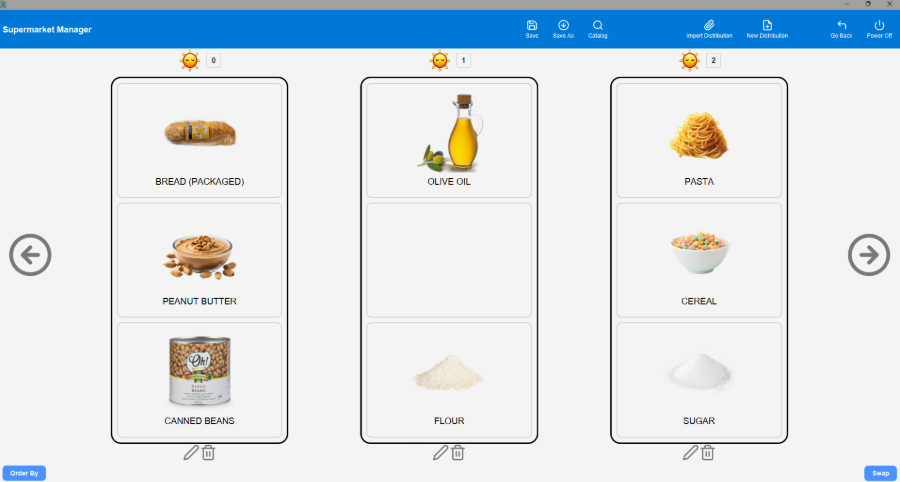
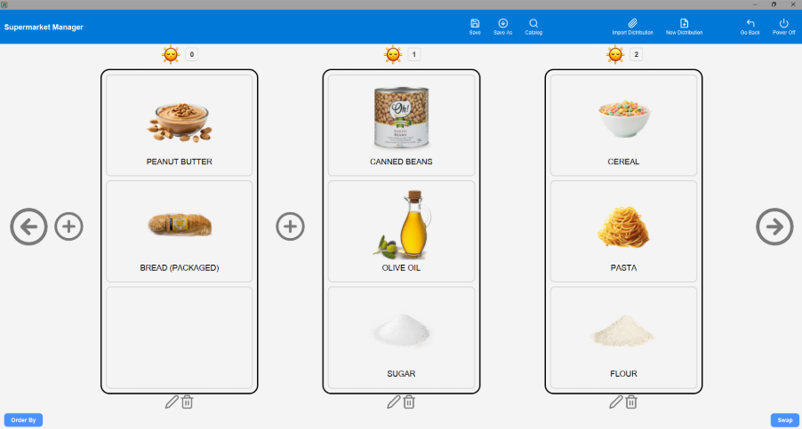
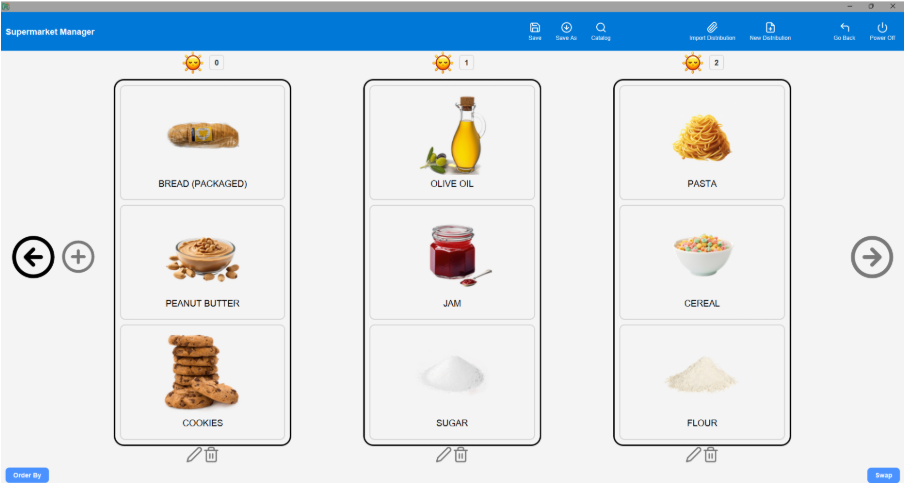
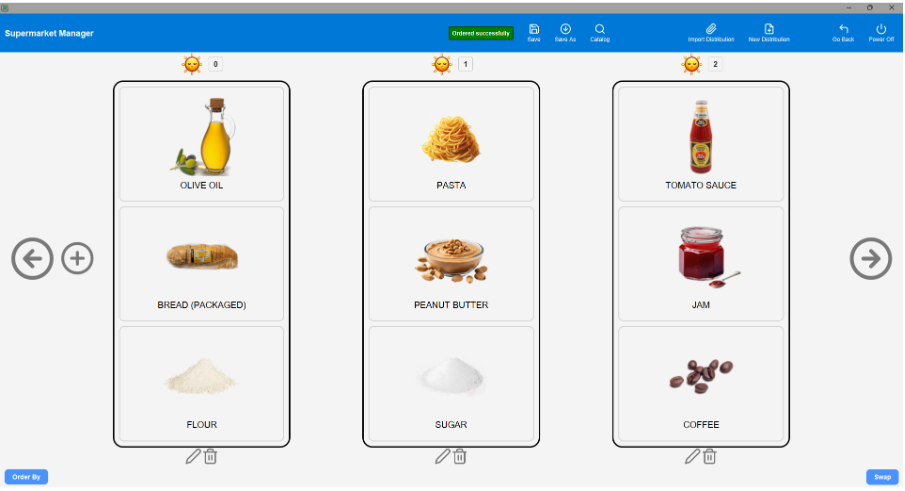

### Guia per provar les opcions d'ordenació per Supermercat i Catàleg

#### **Inici: Accedir a l'aplicació**

1. Obre l'aplicació i accedeix a la pantalla de Log In.
2. Introdueix les credencials:

   - **Usuari:** admin
   - **Contrasenya:** admin

3. Clica el botó "Log In".

   - **Resultat esperat:** Accés concedit i redirecció al menú principal (Main Screen).

4. A la Main Screen, clica el botó "Configuració de la Distribució" per accedir a la vista de gestió de prestatgeries i configuracions.

---

### **1. Opcions d'ordenació des de la vista de Configuració de la Distribució**

#### **Selecció del tipus d'ordenació**

1. A la vista "Configuració de la Distribució", selecciona el botó "Ordenació".
2. Es mostrarà un menú amb dues opcions:

   - **Supermercat**: Per ordenar els productes del supermercat.
   - **Catàleg**: Per ordenar els productes del catàleg.

3. Selecciona una de les opcions per continuar amb el procés d'ordenació.

---

### **2. Ordenació dels productes del Supermercat**

#### **2.1. Ordenació per BruteForce**

##### Acció:

1. Selecciona "Supermercat" al menú d'ordenació.
2. Selecciona el mètode "BruteForce".
3. Confirma l'acció.

##### Resultats esperats:

- Els productes del supermercat es reordenen de manera òptima segons el mètode BruteForce.
- Es mostra un missatge de confirmació: "Ordenació completada correctament."
  

#### **2.2. Ordenació per Greedy**

##### Acció:

1. Selecciona "Supermercat" al menú d'ordenació.
2. Selecciona el mètode "Greedy".
3. Confirma l'acció.

##### Resultats esperats:

- Els productes del supermercat es reordenen segons el mètode Greedy.
- Es mostra un missatge de confirmació: "Ordenació completada correctament."
  

#### **2.3. Ordenació per Approximation**

##### Acció:

1. Selecciona "Supermercat" al menú d'ordenació.
2. Selecciona el mètode "Approximation".
3. Confirma l'acció.

##### Resultats esperats:

- Els productes del supermercat es reordenen segons el mètode Approximation.
- Es mostra un missatge de confirmació: "Ordenació completada correctament."

---

### **3. Ordenació dels productes del Catàleg**

#### **3.1. Ordenació per BruteForce**

##### Acció:

1. Selecciona "Catàleg" al menú d'ordenació.
2. Selecciona el mètode "BruteForce".
3. Confirma l'acció.

##### Resultats esperats:

- Els productes del catàleg es reordenen de manera òptima segons el mètode BruteForce.
- Es mostra un missatge de confirmació: "Ordenació completada correctament."
  

#### **3.2. Ordenació per Greedy**

##### Acció:

1. Selecciona "Catàleg" al menú d'ordenació.
2. Selecciona el mètode "Greedy".
3. Confirma l'acció.

##### Resultats esperats:

- Els productes del catàleg es reordenen segons el mètode Greedy.
- Es mostra un missatge de confirmació: "Ordenació completada correctament."
  

#### **3.3. Ordenació per Approximation**

##### Acció:

1. Selecciona "Catàleg" al menú d'ordenació.
2. Selecciona el mètode "Approximation".
3. Confirma l'acció.

##### Resultats esperats:

- Els productes del catàleg es reordenen segons el mètode Approximation.
- Es mostra un missatge de confirmació: "Ordenació completada correctament."

---

### Objecte de la Prova

#### **Casos d'ús que es proven:**

1. Ordenació dels productes del supermercat.
2. Ordenació dels productes del catàleg.
3. Selecció i aplicació de mètodes d'ordenació (BruteForce, Greedy, Approximation).

---

### Fitxers de dades necessaris

#### **Fitxer per defecte:**

- **Nom del fitxer:** `default.json`.
- **Contingut:** Configuració inicial del supermercat amb informació de prestatgeries (tipus, posició, productes).

---

### Efectes estudiats

#### **Ordenació:**

- Veure si s’ordena correctament.

No hi ha imatges per l'algorisme d'Approximation perquè aquestes poden ser més aleatòries per la natura del propi algorisme.
